\pagebreak

# 1. Preprocessing

## 1.1. Normalization

{height=40%}

$$A(M) = \dfrac{\sum M_{ij}}{Size(M)}$$

$$S = Std(M) = \sqrt{ \dfrac{ \sum((M_{ij} - A(M))^2) }{Size(M)} }$$

$$\delta = \dfrac{\sqrt{S_{0} \times (M_{ij} - A(M))^2}}{S} $$

$$M_{ij} = \begin{cases}A_{0} - \delta,& \text{if } M_{ij} \geq A(M) \\ A_{0} + \delta, & \text{if } M_{ij} < A(M)\end{cases}$$

\pagebreak

## 1.2. Segmentation

{width=33%} {width=33%} {width=33%}

A block $K$ in image $M$ is background if: 

$$Std(K) \leq Std(M) \times \text{threshold}$$

Dilation, followed by Erosion are performed to unify the blocks.

Then, erosion followed by dilation are performed to exclude insignificant blocks.

\pagebreak

## 1.3. Orientation

{width=33%} 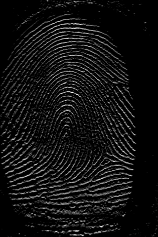{width=33%} 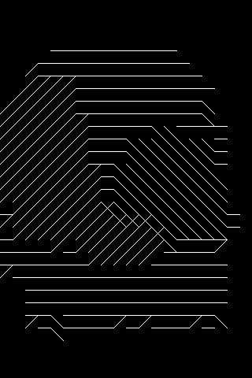{width=33%}

*(The third image is only used for visualization only. It does not take part in any computing process.)*

Sobel Operator is used for detect gradient along $Ox$ and $Oy$.

Then, for each pixel in image, we can calculate the gradient angle:

$$\theta = \tan^{-1}\dfrac{|\overrightarrow{Gx}|}{|\overrightarrow{Gy}|}$$

Then we can calculate the gradient angle for each block.

\pagebreak

## 1.4. Ridges' Frequency

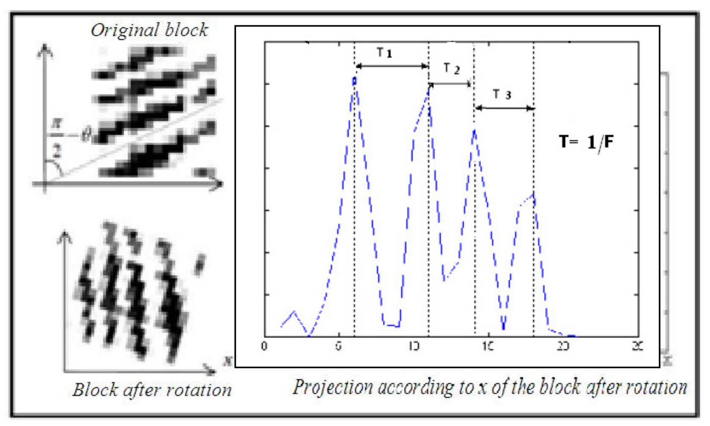{height=40%}

$\theta$ is calculated in the *Orientation* step.

\pagebreak

## 1.5. Gabor filter

{width=33%} {width=33%} 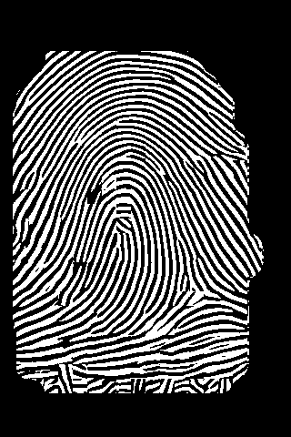{width=33%}

The size of the filter is determined by *ridge frequency*.

The Rotation of the filter is determined by *block orientation*.

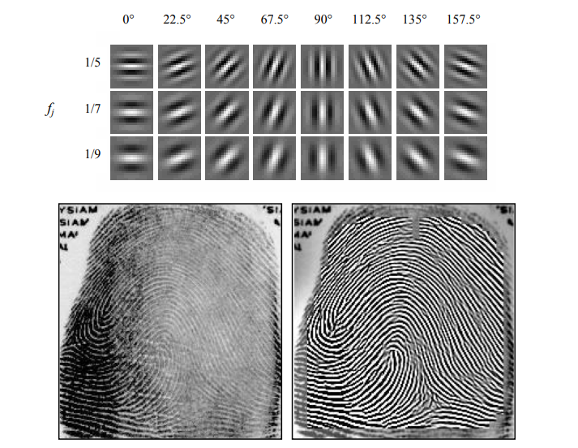{height=40%}

\pagebreak

## 1.6. Skeletonization

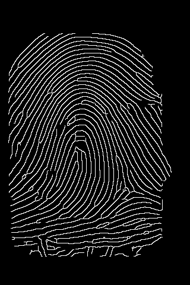{width=40%}

\pagebreak

## 1.7. Singularities and Keypoints

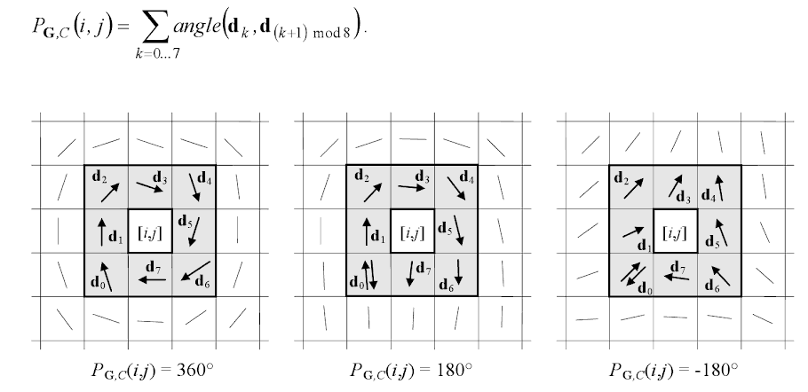{height=25%}

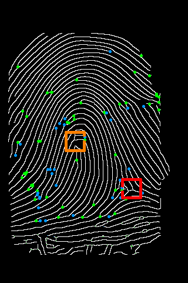{height=40%}

\pagebreak

# 2. Comparing

## Verdict: Match

{width=33%} 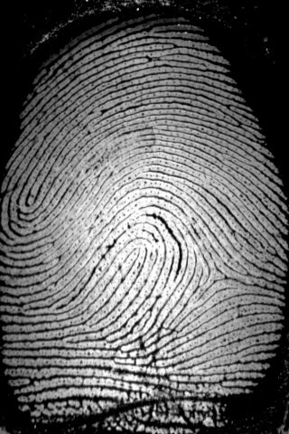{width=33%} 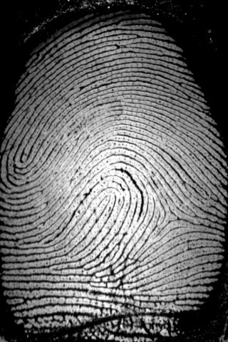{width=33%}

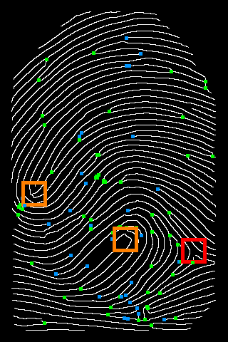{width=33%} 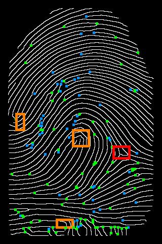{width=33%} 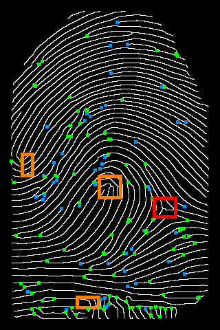{width=33%}

```
Comparing 1 and 9: MMScore = 0.02355706937779257 [True]
Comparing 1 and 10: MMScore = 0.03147042916615236 [True]
```

\pagebreak

## MMScore's Calculation

For each span:

$$\text{Ridges Mismatch Score} = \dfrac{|A-B|}{max(A, b)}$$

\pagebreak

## Verdict: Match

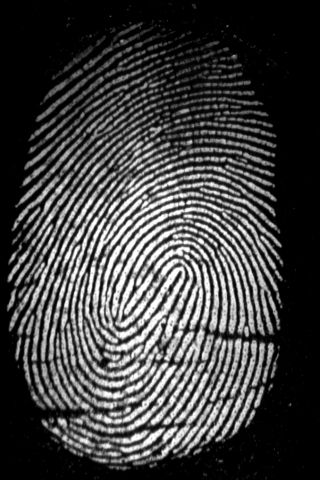{width=33%} {width=33%} {width=33%}

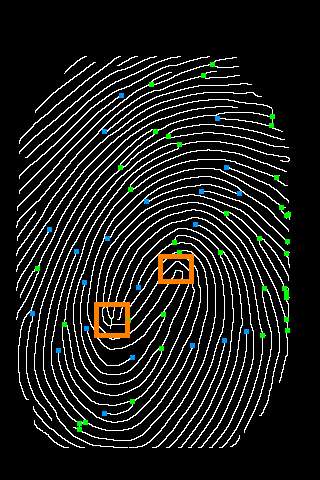{width=33%} 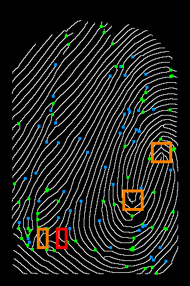{width=33%} 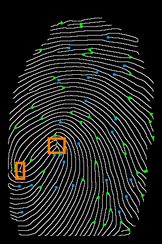{width=33%}

```
Comparing 11 and 13: MMScore = 0.06850775829491 [True]
Comparing 11 and 14: MMScore = 0.057465974475778385 [True]
```

\pagebreak

## Verdict: Mismatch

{width=33%} {width=33%}

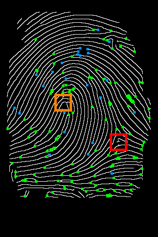{width=33%} 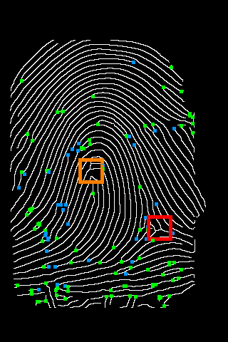{width=33%}

```
Comparing 0 and 4: Ridge MMScore = 0.11450558858066591 [False]
```

\pagebreak

## Verdict: Mismatch

{width=33%} {width=33%}

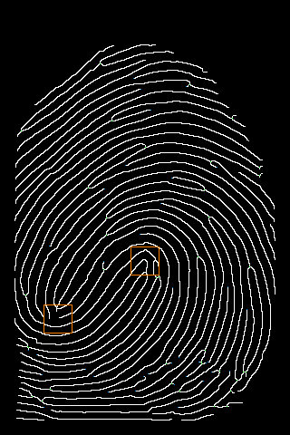{width=33%} 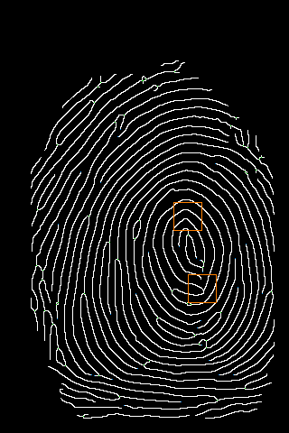{width=33%}

```
Comparing 16 and 21:
CA = (268, 155), CB = (259, 183);
Ridge MMScore = 0.2133995812504585; 
Singu MMScore = 0.5; 
MMScore = 0.7133995812504585 [False]
```
